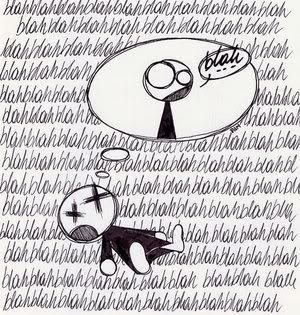

### how much do we need to say

`Working males average 2000-3000, females from 10,000-20000. However, both average about 500-700 words of actual value (i.e. words which have intent to communicate to another person an item of importance to both). - Men are Pigs, (fortunately women like pork) : Jeff Steele, Melbourne, Florida, US`

While we may imagine we communicate in a clever complex manner, a lot of what we say that is actually useful is a lot smaller vocabulary than you would imagine. The amount of useful words used to communicate something to someone, is small - we are self-serving wafflers, trying to establish our points with a mixture of business lingo, body language and strategic alignment with others.  While natural, on a software development project, that can cause pain (and cost).  I am not saying we have to approach specifications in a totally unemotional way, but ultimately you have to derive meaning from what people ask for.  Misinterpretation is common pitfall in tech.  Over-analysing is another. The amount of meetings I have sat through, wondering whether scooping out an eyeball with a finger, would help distract me from the mind-numbing tedium of people pointless discussing minute specification detail. Painful.

User stories are a convenient 3-line approach, to describing requirements - they can be viewed as high-level user journeys, but in that brief format still open to interpretation.  We have all heard the overused phrase “starting the conversation” and that is what user stories are intended to do, but commonly treated as a done deal.  Well-done user stories are useful, and development team can break these down into tasks, and questions.  Only the naiive would think that a user story is enough to fuel development.  What you want is (testable) acceptance criteria.  Fitnesse was the first test framework I used, to create acceptance tests based on natural language. BDD introduced a whole new set of tools to play with on this front, and introduced a standardised format for writing executable specs, called Gherkin.

Gherkin is a commonly maligned, ridiculed, triumphed and underused specification language, has been around for a few years now.  I work in projects that at least aspire to a BDD mentality (i.e. with fantasy that clients will play ball and write scenarios to clarify their user stories), and Gherkin is the common default specification language.  You could spend a lifetime persuading everyone to write the Gherkin, but we are still locked in user story lifeboat mode.  Product Owners commonly love to be chickens rather than pigs. 

It isn't a big shift to think user journeys, instead of user stories.  And this is far closer to specification by example. A far easier way for people to explain themselves in terms of examples. And easier to write down. So firstly you have clear user stories with clear acceptance criteria based on actual examples.  These examples become the acceptance criteria.  The End.

Of course it’s not the end, people change their minds, get things wrongs, influenced by new events.  And with acceptance criteria in testable user journey format, change becomes easier.  The advantage of Gherkin is it’s an executable specification language, and easier to maintain that purely coded tests.  

### what are we trying to say

 Ask a developer how to do acceptance tests in this way, and they will put most test steps in code, not in the transparent Gherkin format. For example, for a test test that require filling in a valid form, a developer will most likely bundle this into one step:

``` javascript
Given I submit a valid contact form
```

There is nothing wrong with this, in fact it's a smart approach if its a form unlikely to change and no inter-dependencies.  The general approach to take is bundle steps only when required - while Gherkin features may look overly verbose, they are also documenting actual steps a user takes.

``` javascript
Given I click on the button Contact
And I fill in #email-address
And I fill in #contact-name 
And I fill in #email-address
When I press Submit
Then I should see message Form has been submitted successfully
```

While there are many advocates of free form Gherkin writing, there is no harm in focusing on generic step-by-step Gherkin, rather than the aesthetically pleasing, but not necessarily helpful, bundled steps. If there are no rules, the test framework becomes at risk of looking like a showcase of different coding styles, and a pain to maintain.  We think we are original, but there are only so many ways to truly explain ourselves.  Completing forms is boring, so why be surprised if the Gherkin to test it looks boring. It’s intended to test requirements, no appeal to visual aesthetics.

There is no need to get precious about keeping Gherkin readable. Infinitely quicker to update element references and test data in Gherkin files than in code. Pragmatism over coding showcase.  After a project the most useful thing to reuse is the framework itself and if your Gherkin is granular enough, easily portable to different projects.  Specification language was aimed at a means to draw more into the acceptance criteria of specifications. The acceptance criteria commonly provides more clarity to specs.  Making your test framework overly clever, code-wise, will block an audience, more than capable of updating tests, even creating them based on existing Gherkin steps.

