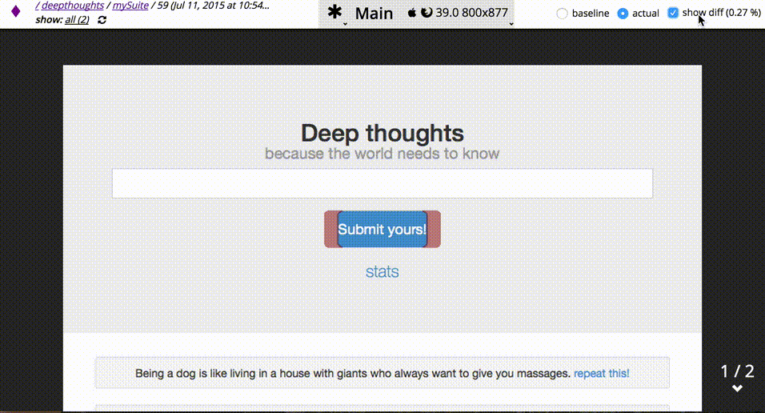

The best of the visual regression tools. As with most similar tools, it utilises selenium screenshots, and image diff tools, to measure change. The difference with this one is it's smart gui regression tests management tool, and it's api which enables a variety of framework to plug into it. 

[Visual Review - Visual Regression Testing](https://github.com/xebia/VisualReview) 

